# ETCQ

ETCD(v3) Cross-platform GUI Client

## Features
- Cross-platform: `macOS` / `Windows` / `Linux`
- Full features compatible with `etcdctl`
- Multi ETCD server manage
- Multi key list manage mode (Full List / Performance / Tree)
- KV, lease, user, role, cluster and more
- Both HTTP and HTTPS connections
- History revision view
- Bulk operations
- I18n supports English, Chinese and more
- Dark mode
- Friendly tips for using the feature

## Installation

### Requirements
- MacOS 10.13+ AMD64
- MacOS 11.0+ ARM64
- Windows 10/11 AMD64/ARM64
- Linux AMD64/ARM64

### Downloads
- [macOS-universal](https://github.com/shockerli/etcq/releases/download/1.2.0/etcq-1.2.0-macos-universal.dmg)
- [macOS-amd64](https://github.com/shockerli/etcq/releases/download/1.2.0/etcq-1.2.0-macos-amd64.dmg)
- [macOS-arm64](https://github.com/shockerli/etcq/releases/download/1.2.0/etcq-1.2.0-macos-arm64.dmg)
- [Windows-amd64-installer](https://github.com/shockerli/etcq/releases/download/1.2.0/etcq-1.2.0-windows-amd64-installer.exe)
- [Windows-amd64-portable](https://github.com/shockerli/etcq/releases/download/1.2.0/etcq-1.2.0-windows-amd64-portable.exe)
- [Windows-arm64-installer](https://github.com/shockerli/etcq/releases/download/1.2.0/etcq-1.2.0-windows-arm64-installer.exe)
- [Windows-arm64-portable](https://github.com/shockerli/etcq/releases/download/1.2.0/etcq-1.2.0-windows-arm64-portable.exe)
- Linux: comming soon

Other packages please see the [releases](https://github.com/shockerli/etcq/releases) page.

## Screenshots

- Service List

    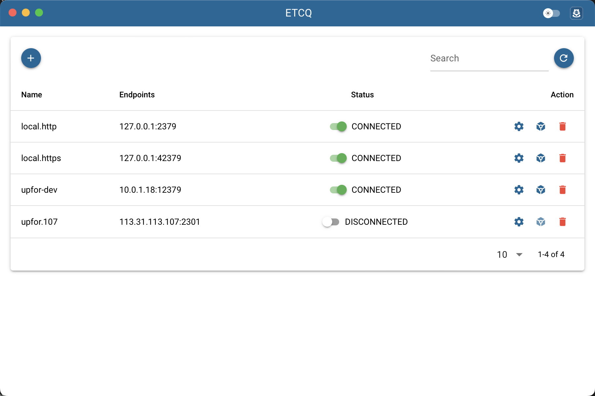

- Setting HTTPS

    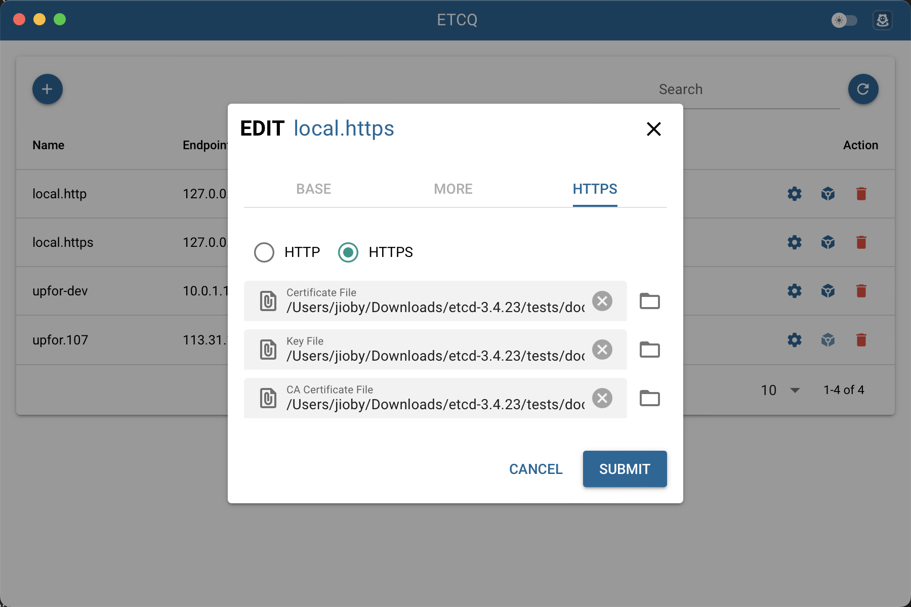

- Key List

    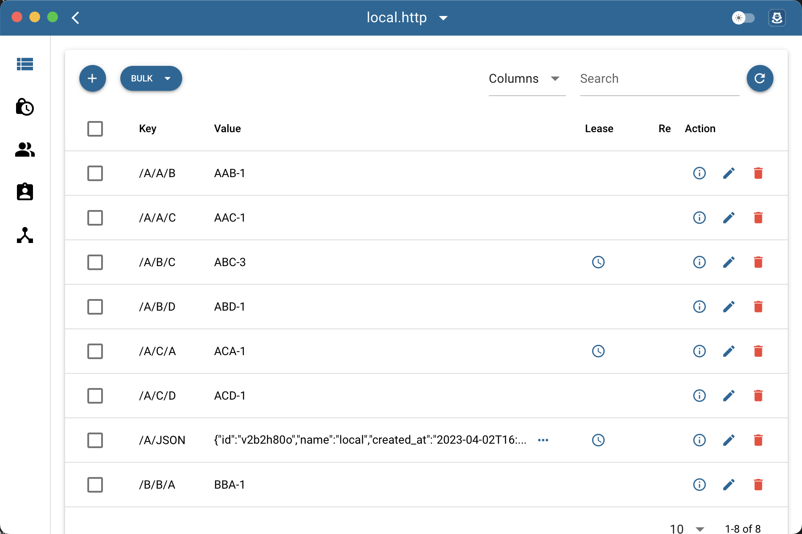ing-https.png)

- Key Detail

    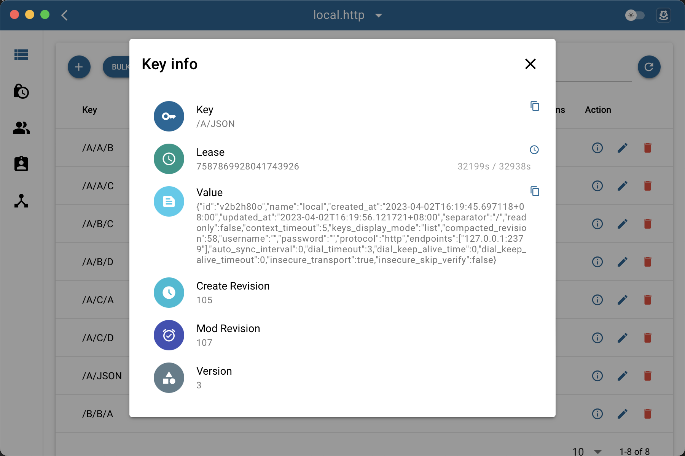

- Key Edit

    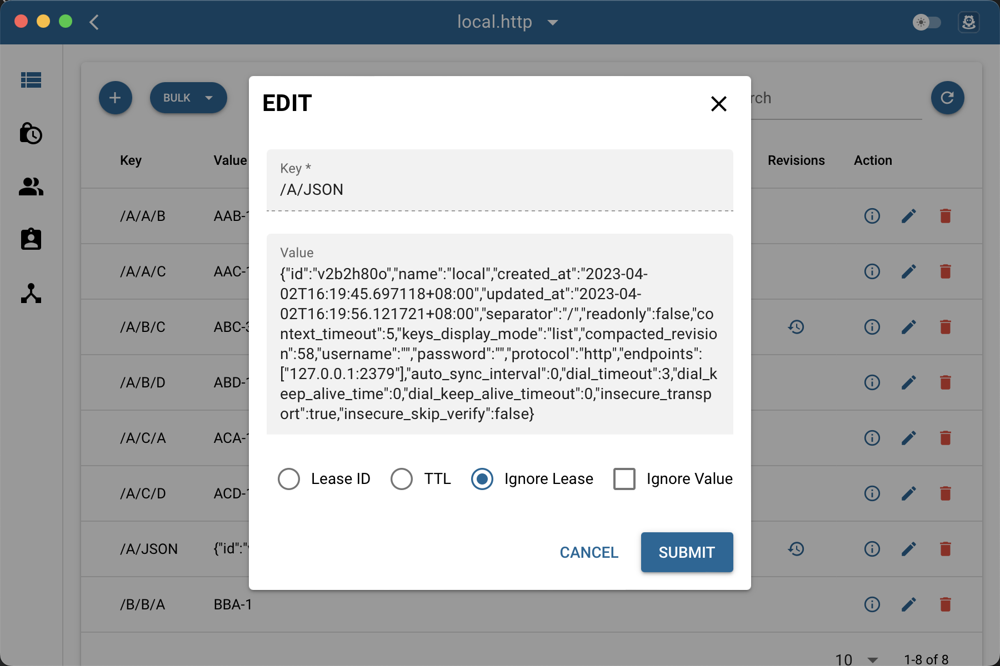

- Key Lease

    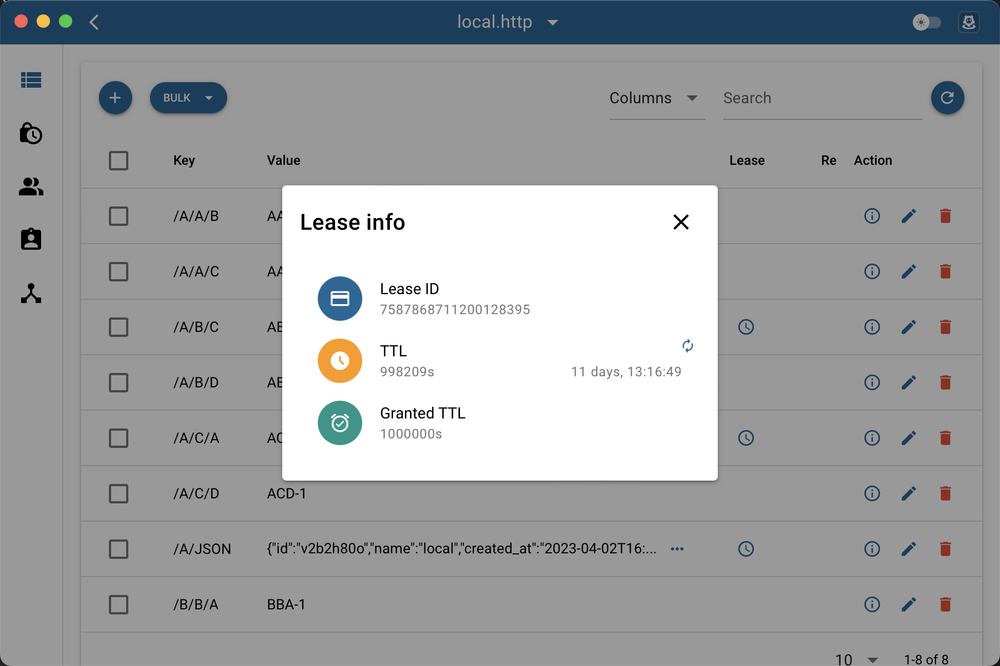

- Key Revisions

    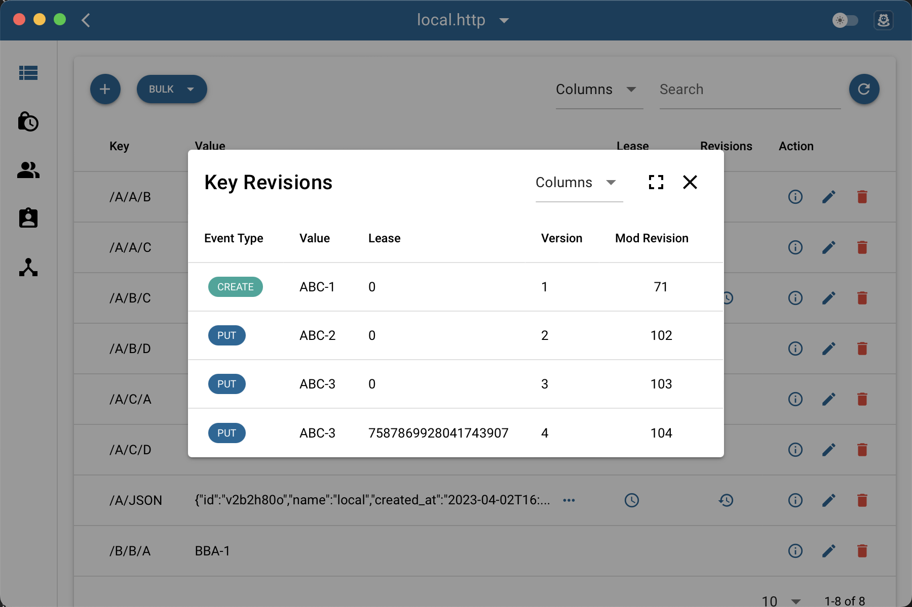

- Lease Keep Once

    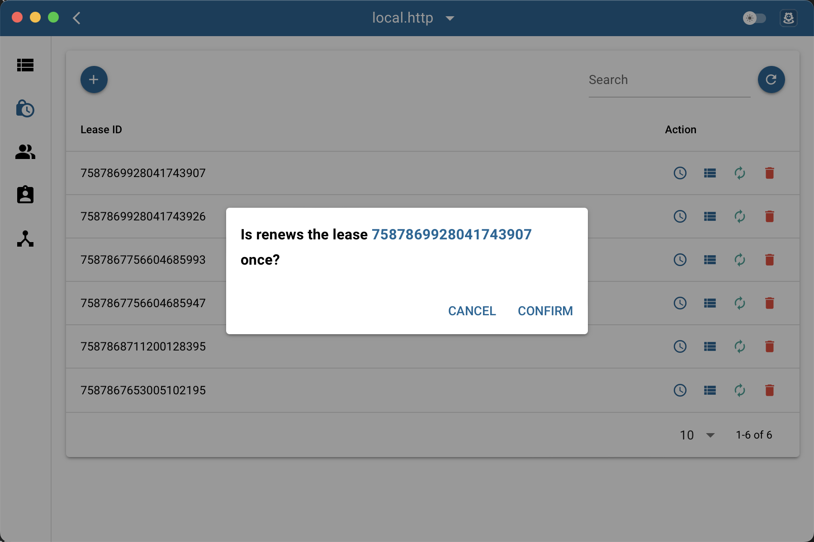

- Role Permissions

    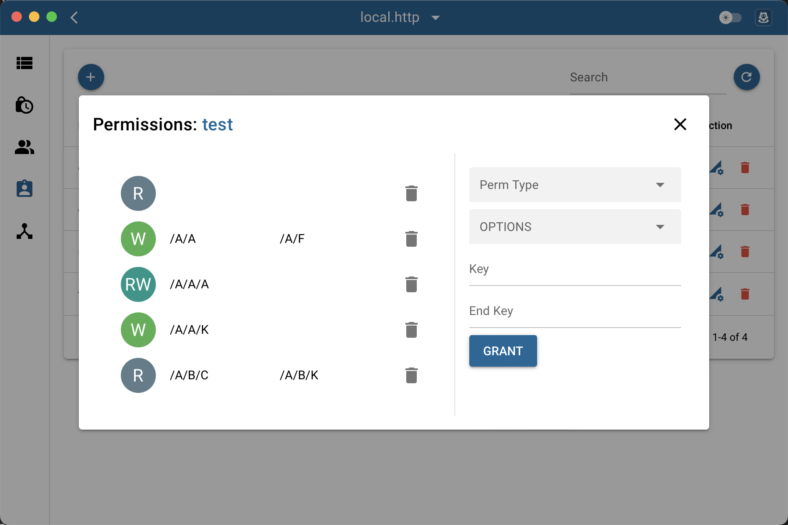

- Role Permissions

    

- User Grant

    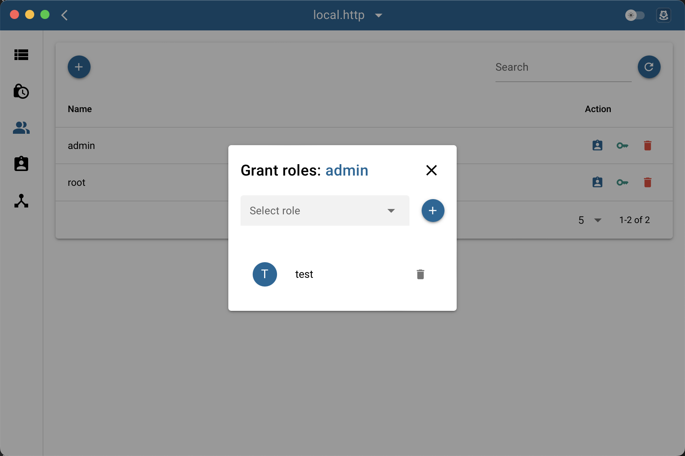

- Preferences

    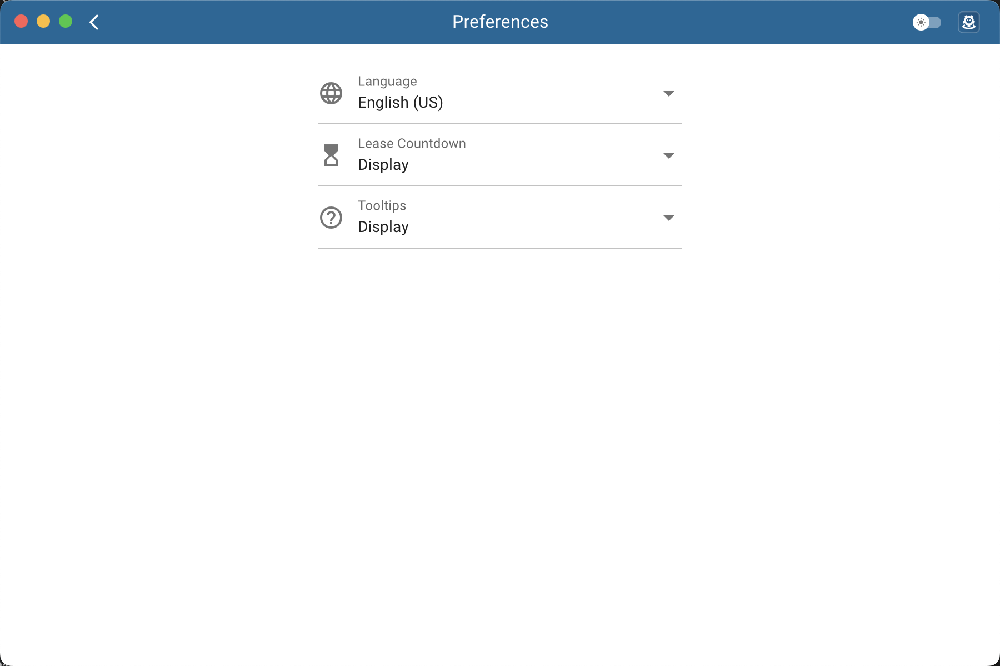

- Service Quick Switch

    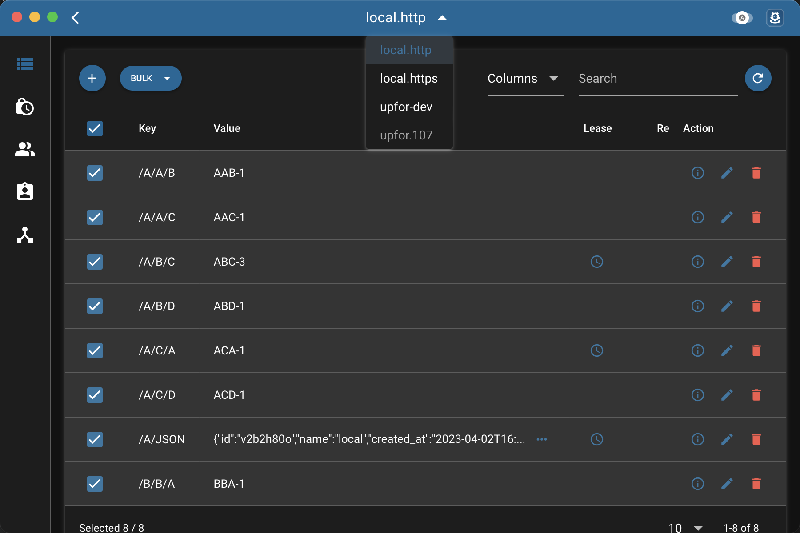

## Author
- [Jioby](https://github.com/shockerli)

## Copyright
[@shockerli](https://github.com/shockerli)

